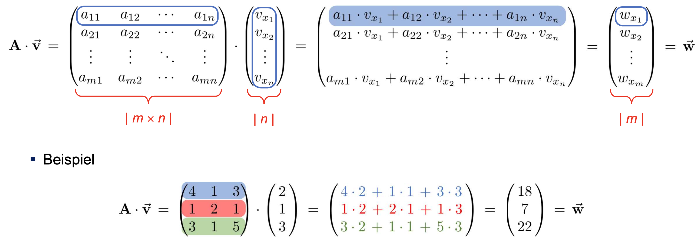

---
titlepage: true
titlepage-color: "ffffff"
titlepage-rule-color: "ffffff"
titlepage-text-color: "000000"
toc-own-page: true
colorlinks: false
title: Zusammenfassung Methods and Algorithms
author:
  - Yannick Hutter
lang: de
date: "17.02.2024"
lof: true
toc: true
mainfont: SF Pro Display 
sansfont: SF Pro Display 
monofont: JetBrainsMono Nerd Font
header-left: "\\small \\thetitle"
header-center: "\\small \\leftmark"
header-right: "\\small \\theauthor"
footer-left: "\\leftmark"
footer-center: ""
footer-right: "\\small Seite \\thepage"
...

\newpage


# Mögliche Prüfungsfragen

> Was ist der Unterschied zwischen Kovarianz und Korrelation?

- Kovarianz misst Richtung des linearen Zusammenhangs zwischen zwei Variablen, d.h. ob die Variablen tendenziell zusammen steigen/fallen
- Korrelation misst sowohl die Richtung als auch die Stärke des linearen Zusammenhangs zwischen zwei Variablen, sie ist die normierte Version der Kovarianz

> Was sind typische Vertreter für Klassifikations- und Vorhersagemodelle?

Zu den typischen Vertretern gehören:
- lineare Regression
- k-nächste-Nachbarn (k-nearest neighbours / k-NN)
- k-Mitten (k-means)

> Was ist der Unterschied zwischen Baum und Graf?

Ein Baum hat keinen Zyklus, d.h. man kann nur von oben nach unten wandern aber nicht mehr zurück.

> Was ist der Unterschied zwischen einer Simulation und Data Science?

Die Datengrundlage für Simulationen wird aufgrund von physikalischen Modellen und Formeln erzeugt, wohingegen diese für Data Science oftmals bereits vorhanden ist.

> Was ist der Unterschied zwischen K-Nearest Neighbour und K-Means?

Im K-Nearest Neighbour wird darauf geachtet, was die "Nachbarn" machen. Auf Grundlage dieser Beobachtung wird dann die eigene Entscheidung getroffen.

> Was ist der Unterschied zwischen einer linearen und einer nicht-linearen Funktion?

Eine lineare Funktion entspricht einer Geraden, wohingegen eine nicht-lineare Funktion einer Kurve entspricht. Bei der linearen Funktion kann aufgrund des X-Werte auf den Y-Wert geschlossen werden **und umgekehrt**. Dies ist bei der nicht linearen Funktion nicht der Fall.

> Was bedeutet eine Steigung von 1?

Eine Steigung von 1 entspricht 45%, d.h Delta-X und Delta-Y sind gleich gross


> Was ist der MSE Wert?

Der MSE, d.h. Mean Squared Error beschreibt die Güte der Regressionsgerade. Ist der Wert 0 so liegen die Punkte perfekt auf der Gerade. Ein negativer Wert ist nicht möglich.

*Achtung: Der Wert ist nicht normiert.*

> Was ist der R2 Wert?

Der R2 Wert ist ein normierter Wert. Der Wert sagt aus, wie das Verhältnis zischen der erklärten Varianz zur nicht erklärten Varianz ist. 1 bedeutet die Gerade passt perfekt auf die Punkte und 0 bedeutet die Gerade passt überhaupt nicht zu den Punkten.

> Was ist Overfitting?

Das Modell kann genau nur die gelernten Daten vorhersagen aber keine neuen.

> Was ist Underfitting?

Das Modell kann die Daten gar nicht vorhersagen, es ist unbrauchbar evtl. aufgrund einer zu kleinen Datengrundlage.

> Was ist K-Nearest-Neighbour und wie funktioniert er?

Ist ein Standardalgorithmus zur Klassifikation. Der K-Nearest Neighbour ist ein Algorithmus des `supervised Learnings` (d.h. wir kennen die Antwort). Hierzu werden die `ähnlichsten Nachbarn` miteinander verglichen, d.h. es muss ein Mass für "Ähnlichkeit" definiert werden. Folgende Bausteine sind für den Algorithmus notwendig:

- Ähnlichkeits- bzw. Distanzmetrik (definiert was "ähnlich" bedeutet). Hierzu wird oftmals der **Euklidische Abstand** (Luftlinie zwischen zwei Punkten) verwendet.
- Klassifikationsalgorithmus
- Festlegung eines Bewertungsmass (wie gut oder schlecht war die Klassifikation)
- Aufteilung der Daten in Trainings- und Testdaten
- Mehrere Durchläufe für unterschiedliche k-Werte da wir nicht wissen welcher k-Wert optimal ist
- Wählen desjenigen k-Wertes, welcher am besten abgeschnitten hat
- Klassifiziere die Daten anhand des gewählten k-Wertes

Der Algorithmus läuft folgendermassen ab:

- Wenn ein neuer Punkt hinzugefügt wird muss der Abstand zu allen anderen vorhandenen Punkten berechnet werden
- Anschliessend schaut man sich die Abstände in einem bestimmten Radius an und es gilt der Mehrheitsentscheid


> Welche Probleme können beim K-Nearest-Neighbour auftreten?

- Beim K-Nearest-Neighbour können `Skalierungseffekte` auftreten, wenn bspw. die eine Grösse markant grösser ist als die andere, d.h. der eine Wert vom anderen dominiert wird. Um diesem Effekt entgegenzuwirken müssen die Werte auf eine Art und Weise einander angeglichen werden.
- Je höher dimensioniert der Raum ist, desto schlechter funktioniert der k-NN Algorithmus, da die Punkte je höher die Dimension wird, weiter auseinanderliegen und entsprechend auch die Rechenzeit steigt
- Gewichtung: Manche Attribute sind wichtiger/prägnanter als andere

> Was ist der K-Means Algorithmus?

Ist ebenfalls ein Standardalgorithmus zur Klassifikation. Der K-Means Algorithmus ist ein Algorithmus des `unsupervised Learnings` (d.h. wir kennen die Antwort nicht).

> Was besagt die Kardinalität einer Menge?

Die Kardinalität besagt, wie viele Elemente eine Menge beinhaltet.


> Wann kann der K-Means Algorithmus angewendet werden?

Falls wir `unklassifizierte Daten` besitzen, von denen wir die Labels nicht wissen. Man möchte aber trotzdem etwas aus den Daten lernen, d.h. man möchte die Daten trotzdem in bestimmte Gruppen einteilen. Die Komplexität des Algorithmus ist `O(N)`.

> Was ist die Idee hinter dem K-Means Algorithmus?

- Klassifikation der Daten durch Clusterbildung, d.h. unter der Annahme: "Wenn die Daten nahe beieinander liegen, müssen sie eine gewisse Ähnlichkeit besitzen"
- Cluster sollen Elemente `mit ähnlichen Attributen` enthalten
- Der Anwender des Algorithmus muss angeben `wieviele Cluster` man will, d.h. `k wird vorgegeben`
- Der Algorithmus denkt sich `k beliebige Punkte im Raum aus`
- Anschliessend wird der euklidische Abstand (Pythagoras) eines jeden Punktes zu den definierten k's ermittelt
- Die Punkte werden anhand des euklidischen Abstandes den jeweiligen k's zugeordnet
- Anschliessend wird der Schwerpunkt der Cluster berechnet (zur Einfachheit wird der Mittelpunkt der Cluster berechnet)
- Anschliessend werden wieder die Abstände berechnet, bis sich der Mittelpunkt nicht mehr gross ändert (mit Änderung ist die Änderung der Klasse gemeint, nicht die Position)

> Welche Probleme können beim K-Means Algorithmus auftreten?

- Richtige Wahl des k's
- Konvergenz (Erreichung eines finalen Ergebnis) ist nicht garantiert, d.h. Algorithmus muss irgendwann abgebrochen werden (Definition maximale Anzahl von Durchläufen)
- Ob die Klassifikation der Cluster sinnvoll ist muss der Anwender entscheiden
- Der K-Means Algorithmus ist im Vergleich zu anderen Algorithmus zwar sehr einfach aber auch sehr schnell

> Was ist die Trägheit (Inertia)?

Ist die Summe aller Abstände von den einzelnen Punkten zum Cluster Mittelpunkt, d.h. ist die Trägheit sehr gross, sind die Punkte sehr verstreut. Es sollte jener Punkt gewählt werden, bei welchem ein Knick erfolgt.


> Wie sollte mit hochdimensionierten Datensätzen umgegangen werden? 

- Grundsätzlich muss ein hochdimensionierter (Dimension = Kategorie) Datensatz auf möglichst wenig Dimensionen reduziert werden, ohne dass kein essenzieller Informationsverlust entsteht
- Principal Component Analysis erlaubt Dimensionalitätsreduktion


> Warum stehen die Achsen bei der PCA immer senkrecht zueinander?

Weil man dann nichts "kaputt" macht, d.h. wenn man diagonal zur Tür laufen würde, dann hätte man ein wenig "Weg" kaputt gemacht. Dies passiert bei orthogonalen Achsen nicht.

> Was unterscheidet die Lineare Regression vom k-NN?

Die Lineare Regression liefert keine kontinuierliche Variablen sondern kategoriale Variablen.

> Was ist der Unterschied zwischen dem Cosinus und dem Manhattan Abstand?

- Der Cosinus Abstand wird verwendet um den Winkel oder die Richtung zwischen zwei Vektoren zu messen, unabhängig von ihrer Länge
- Der Manhattan Abstand misst die tatsächliche Distanz zwischen Punkte in einem rechtwinkligen Koordinatensystem


# Lineare Regression
Die lineare Regression gehört zu den meist genutzten statistischen Methoden, sie drückt **die mathematische Beziehung zwischen zwei Variablen** aus, d.h. für eine lineare Regression muss es einen **linearen Zusammenhang zwischen Antwort- und Prädiktorvariable** geben. Die lineare Regression versucht die bestmögliche Gerade zu finden, welche zu den Daten passt. Unter bestmöglicher Gerade ist hierbei der Abstand von den Punkten zur Gerade gemeint, dieser sollte **minimal** sein. 
Die Geradengleichung an sich lässt sich folgendermassen ausdrücken:

\begin{align}
    y &= f(x) = B_{0} + B_{1} * x\notag\\
    B_{0} &= Achsenabschnitt\notag\\
    B_{1} &= Steigung = \frac{\triangle{y}}{\triangle{x}}\notag
\end{align}

Die Abstände zwischen den Punkten zur Gerade lassen sich folgendermassen berechnen:

\begin{align}
   r_{i} = y{i} - \hat{y_{i}}\notag
\end{align}

Schlussendlich gilt, dass die Summe der Fehlerquadrate möglichst klein ist:

\begin{align}
   \sum_{i}r_{i}^2\notag
\end{align}


## Berechnung des Fehlers
Um die Genauigkeit der Linearen Regression vorherzusagen, kann der Fehler d.h. Abweichung zwischen dem vorhergesagtem und tatsächlichem Wert berechnet werden. Hierzu gibt es unterschiedliche Mase:

### Mittlere quadratische Abweichung (MSE)

> Je kleiner der MSE desto kleiner der Fehler

Die mittlere quadratische Abweichung ergibt sich in dem die Fehlerquadratsumme durch die Anzahl der Elemente geteilt wird.

\begin{align}
   MSE = \frac{\sum_{i}r_{i}^2}{n}\notag
\end{align}

Die MSE ist ein gutes Mass für die **Varianz**, d.h. wie stark die vorhergesagten Werte von den tatsächlichen Werten variieren

Der MSE kann auch zur Validierung von Test und Trainingsdaten verwendet werden:
- MSE der Testdatene berechnen und mit MSE der Trainingsdaten vergleichen
- Sind die Werte nahezu identisch ist das Modell brauchbar, ansonsten Gefahr von Under-/Overfitting

### Bestimmtheitsmass (R2)

> Je kleiner R2 desto höher die Variabilität, desto schlechter die Güte der Regressionsgerade.

Das Bestimmtheitsmass drückt den Anteil der Variabilität in den Messwerten aus


\begin{align}
   R^2= 1 - \frac{\sum_{i}r_{i}^2}{\sum_{i}(y_{i} - \bar{y})^2}\notag
\end{align}


## Python Code

### Lineare Regression zeichnen

```python
from sklearn.linear_model import LinearRegression as lr
import matplotlib.pyplot as plt 

xdata = data[:,0].reshape((-1, 1)) # (-1,1) Unbekannte Anzahl an Zeilen bei genau einer Spalte -> Spaltenvektor
ydata = data[:,1].reshape((-1, 1)) # (-1,1) Unbekannte Anzahl an Zeilen bei genau einer Spalte -> Spaltenvektor

model = lr()
model.fit(xdata, ydata)

y_pred = model.predict(xdata)
plt.plot(xdata, y_pred, 'b-')
plt.plot(xdata, ydata, 'ro')
plt.show()
```
### MSE

```python
from sklearn.metrics import mean_squared_error as mse
mse(y_true, y_pred, squared=True)
```

### R2 

```python
from sklearn.metrics import r2_score 
r2_score(y_true, y_pred)
```

# k-nächste-Nachbarn

> Wichtig: Der k-NN Algorithmus kann nur auf klassifizierten (gelabelten) Datensätzen angewendet werden.

Grundsätzlich funktioniert der k-NN Algorithmus folgendermassen:
- Betrachtung **ähnlicher** Objekte (im Hinblick auf ihre Attribute)
- Entscheide für die Klassifizierung gemäss Mehrheitsentscheid (schauen was der nächste Nachbar macht)
- Bei Gleichstand wird zufällig entschieden

Die Anzahl der Nachbarn welche betrachtet werden sollen wird über den Parameter *k* definiert.

## Bestimmung des Abstandes

> Achtung: Beim bestimmten des Abstandes können Skalierungseffekte auftreten, d.h. die Werte zuerst normieren

Für die Bestimmung der Abstände gibt es verschiedene Verfahren:


**Abstand über die Position**

Der Abstand zu den Nachbarn betreffend der Position wird über den *Euklidischen Abstand* festgelegt, d.h.

\begin{align}
    d(P1, P2) = \sqrt{(x_{2} - x_{2})^2 + (y_{2} - y_{1})^2}\notag
\end{align}

**Abstand über Ähnlichkeit/Distanzmetrik**

Für den Abstand über die Ähnlichkeit kann der *Jaccardsche Abstand* verwendet werden. Die dabei ist, dass dieser Abstand über Mengen gebildet wird. Hierbei wird die Union der Mengen durch die Intersection geteilt:

\begin{align}
    J(P1, P2) = \frac{|A\cup B|}{|A \cap B|}\notag
\end{align}

Eine weitere Möglichkeit besteht über den *Hamming Abstand*. Die Idee dabei ist, dass die Ähnlihckeit anhand von Sequenzen, bspw. "ABCD" und "ABCDEFGH" bestimmt wird. Hierbei wird geschaut, an wievielen Stellen sich die Sequenzen unterscheiden.

\begin{align}
    A = ABCDEFG\notag \\
    B = ABCDEFGH\notag \\
    H(A, B) = 1\notag \\
\end{align}

Vektoren lassen sich mithilfe der *Cosinus Ähnlichkeit* vergleichen. Die Werte bei der Consinus Ähnlichkeit reichen hierbei von -1 bis 1:

- 0 bedeutet, die Vektoren stehen ortogonal (rechtwinklig) aufeinander
- 1 bedeutet, die Vektoren zeigen exakt in die gleiche Richtung
- -1 bedeutet, die Vektoren zeigen exakt in die entgegengesetzte Richtung

Der Cosinus Abstand wird mithilfe des Skalarprodukts berechnet, dieses wird durch die Länge der Vektoren geteilt:

\begin{align}
    cos(\vec{x}, \vec{y}) = \frac{\vec{x} \cdot \vec{y}}{||\vec{x}|| ||\vec{y}||}
\end{align}

Ebenso können Vektoren über den *Manhattan Abstand (L1 Abstand)* verglichen werden. Wichtig beim Manhattan Abstand zu beachten ist, dass hier die Distanz zwischen zwei Punkten *auf einem Gitter* gemessen wird, d.h. nur horizontale und vertikale Bewegungen sind erlaubt.

\begin{align}
    d(\vec{x}, \vec{y}) = \sum_{i} |x_{i} - y_{i}| \notag
\end{align}

Der Manhatten Abstand gibt einen Wert zwischen 0 und Unendlich zurück, wobei 0 bedeutet, dass die Vektoren identisch sind.

## Funktionsweise
Es werden folgende Schritte durchlaufen:

- neues Element einfügen
- Berechnung aller Distanzen (O(n))
- Auffinden der k nächsten Nachbarn
- Bestimmung der zugehörigen Kategorien
- Mehrheitsentscheid

## Bewertung 
Die Bewertung kann mittels **Treffsicherheit** oder dem **Hamming Verlust (Fehlinterpretation)** berechnet werden.
Die Treffsicherheit kann folgendermassen berechnet werden:

\begin{align}
    accuracy(y, \hat{y}) = \frac{1}{n} \sum_{i} 1(\hat{y_{i}} = y_{i}) \notag
\end{align}

Der Hamming Abstand ist das Gegenteil der Treffsicherheit, d.h.:

\begin{align}
    L_{Hamming}(y, \hat{y}) = \frac{1}{n} \sum_{i} 1(\hat{y_{i}} != y_{i}) \notag \\
    1 - accuracy(y, \hat{y}) \notag
\end{align}

## Python Code

### Beispiel für k-NN
```python
from sklearn.neighbors import KNeighborsClassifier as knn 
from sklearn.model_selection import train_test_split as tts
from sklearn.metrics import accuracy_score as score

x_train, x_test, y_train, y_test = tts(data[:,:2], data[:,2], test_size=0.3)
model = knn(n_neighbors=k)
model.fit(x_train, y_train)
y_pred = model.predict(x_test)
score(y_test, y_pred)
```
### Beispiel zur Bestimmung des optimalen k-Wertes

```python
for k in range(1,16):
    model = knn(n_neighbors=k) model.fit(x_train, y_train)
    y_pred = model.predict(x_test)
    print(k, ':', score(y_test, y_pred))
```

# k-Means
Im Gegensatz zum k-NN Algorithmus kommt der k-Means Algorithmus ohne Labels aus, d.h. ist ein Algorithmus des **unüberwachten Lernens**. Die Grundidee hinter dem k-Means Algorithmus ist es, die Daten mithilfe von **Clustering** zu klassifizieren, wobei jeder Cluster Elemente mit **ähnlichen** Attributen beinhalten soll.

Die Interpretation der Lösung ist aber oftmals fragwürdig, jedoch ist der k-Means Algorithmus im Vergleich zu anderen Cluster Algorithmen **sehr schnell**.

## Funktionsweise
Zu Beginn muss die Anzahl der Cluster mithilfe des Parameters k festgelegt werden. Anschliessend durchläuft der Algorithmus folgende Schritte:

- Auswahl k zufälliger Mittelpunkte
- Zuweisung jedes Datenpunktes zum nächstgelegenen Mittelpunkt
- Verschiebung des Mittelpunkt in die Mitte aller zugewiesenene Datenpunkte
- Wiederholen der Schritte 2 und 3 bis keine oder wenig Änderung erfolgt

## Bestimmung des k-Wertes
Falls der k-Wert nicht bekannt sein sollte, kann er über die **Ellenbogen-Methode** bestimmt werden. Grundsätzlich versucht der k-Means die Trägheit (intertia) der Mittelpunkte zu minimieren. Ein guter k-Wert ist beim "Knick" der Ellenbogenmethode. Der Knick in der Ellenbogenmethode ist jener Punkt, bei dem eine weitere Erhöhung der Cluster k zu einer signifikant geringeren Verbesserung führt.

## Python Code

```python
from sklearn.cluster import KMeans

model = KMeans(n_clusters=k, max_iter=value)
y_pred = model.fit_predict(data)

col = ListedColormap(['red', 'blue', 'green'])
sp = plt.scatter(data[:,0], data[:,1], c=y_pred, cmap=col)
lab = (['C1', 'C2', 'C3']
plt.legend(handles=sp.legend_elements()[0], labels=lab)
plt.show()
```

### Kleckse und Monde erzeugen

```python
from sklearn.datasets import make_blobs

x, y_true = make_blobs(n_samples=value, centers=value)
```

```python
from sklearn.datasets import make_moons 

x, y_true = make_moons(n_samples=value, noise=value)
```

### Farben im Bild reduzieren

```python
# Bild einlesen
img = plt.imread('papa_color.png')

# Farbwerte extrahieren (512x512 ist Auflösung mit 3 Farbkanälen)
data = np.reshape(img, (512*512, 3))

# KMeans anwenden um Farben zu reduzieren (16 Farben)
from sklearn.cluster import KMeans
model = KMeans(16)
model.fit(data)
data_reduced = model.cluster_centers_[model.predict(data)]

# Farbwerte extrahieren und darstellen
img16 = np.reshape(data_reduced, (512, 512, 3)) plt.imshow(img16)
plt.show()
```

### Bestimmung des optimalen k-Wertes

```python
inert = []
for k in range(1,11):
  model = Kmeans(n_clusters=k)
  model.fit(data)
  inert.append(model.inertia_)
```

# PCA
Die PCA ist eine Methode zur Dimensionsreduktion auf ein paar wenige Attribute. Dies ist notwendig, da viele Aufgaben unzählig viele Attribute pro Datenpunkt beinhalten. Dieser Umstand ist auch als **Fluch der Dimension** bekannt.

> Je mehr Dimensionen vorhanden sind, desto grösser wird der Abstand zwischen zwei beliebigen Datenpunkten, d.h. Gefahr von Overfitting

Die Dimensionsreduktion kann beispielsweise mittels **Projektion** erreicht werden.

- Bei der PCA wird ein Vektor mit einer Matrix multipliziert
- Die Anzahl der Spalten muss genauso gross sein wie die Anzahl der Elemente im Vektor
- Die Anzahl der Zeilen kann variieren
- Am Ende stehen nicht mehr die Originalkategorien drin, es ist eine Mischung aus den einzelnen Gewichtungen der Kategorien
- Die PCA analyisiert den Datensatz und findet eine Matrix
- Daten sind in der Regel nicht gleichmässig über alle Dimensionen verteilt (2d vs 3d)
- Die PCA drückt jene Dimension zusammen (reduziert), in denen die Daten am wenigsten streuen
- Hierzu können die Punkte beispielsweise auf eine Ebene proiziert werden. Hierzu wird der orthogonale Abstand (kürzester Abstand) genutzt
- Achtung die PCA ist `kein Klassifikationsalgorithmus` sondern dient zur Vorverarbeitung der Daten
- Bei der PCA wird darauf geachtet, dass **möglichst viel von der ursprünglichen Varianz beibehalten wird**

## Arten der Dimensionen
Es gibt folgende dimensionalitäten bei den Daten:

- Skalare - 0D Tensor
- Vektoren (1D Reihung) - 1D Tensor
- Matrizen (2D Reihung) - 2D Tensor

## Ablauf

> Die PCA findet in einem d-dimensionalen Raum d orthogonale Achsen

Grundsätzlich findet die PCA diejenigen Hyperebenen, die den Daten am nächsten ist und proiziert sie darauf, d.h. **mittlerer quadratischer Abstand** zwischen Daten und Hyperebene ist minimal.

Unter einer Hyperebene wird folgendes verstanden:

- 2D - Gerade
- 3D - Ebene
- nD - Hyperebene

Der Ablauf der PCA ist folgendermassen:

- Finde die erste Achse auf dener die Daten am meisten streuen, d.h. grösste Varianz
- Finde die zweite Achse (die muss senkrecht auf der ersten sein), auf der die Daten am zweitmeisten streuen
- Die dritte Achse muss senkdrecht auf der ersten und auf der zweiten sein usw.

Die Achsen sind hierbei als **Vektoren durch den Ursprung** vorstellbar. Gespeichert wird die PCA als Matrix mit Vektoren als Spalten.

## Python Code

```python
from sklearn.decomposition import PCA

data = np.loadtxt("decomp_test.dat", delimiter=",")

model = PCA(n_components=2)
model.fit(data)
print(model.explained_variance_ratio_)

plt.plot(data[:,0], data[:,1], 'mo')
plt.show()
```

### Punkte auf Hauptkomponente projizieren

```python
model = PCA(n_components=2)
data_proj = model.fit_transform(data)
y = np.zeros([len(data_proj)])

plt.plot(data_proj[:,0], y, 'mo')
plt.plot(y, data_proj[:,1], 'co')

plt.show()
```

### Verteilung der Varianz darstellen

```python
img = plt.imread('papa.png')
plt.imshow(img, cmap='gray')
plt.show()

model = PCA()
model.fit(img)
plt.plot(np.cumsum(model.explained_variance_ratio_))
plt.show()
```

### Hauptkomponentenzerlegung mit Varianz

```python
model = PCA(0.90) # 90% Varianz
img_rec = model.inverse_transform(model.fit_transform(img))
```

### Bilder entrauschen

```python
model = PCA(0.99)
de_noise = model.inverse_transform(model.fit_transform(noise))
```

### Mnist Datensatz reduzieren

```python
from sklearn.datasets import load_digits

digits = load_digits()
digits.data.shape

# Datensatz als Graubilder darstellen
from myplot import plot_digits
plot_digits(digits.data)
plt.show()

# Dimensionsreduktion auf 2 Hauptkomponenten
from sklearn.decomposition import PCA
model = PCA(n_components=2)
d_proj = model.fit_transform(digits.data)
print(model.explained_variance_ratio_)

# Projektion umkehren und reduzierter Datensatz plotten
d_recov = model.inverse_transform(d_proj)
plot_digits(d_recov)
plt.show()
```

### Schweizer Rolle

```python
from sklearn import datasets
import matplotlib.pyplot as plt

data, shape = datasets.make_swiss_roll(n_samples=1000, noise=0.0)
fig = plt.figure()

ax = fig.add_subplot(projection='3d')
ax.scatter(data[:,0], data[:,1], data[:,2], c=shape)

plt.show()
```

# Diskriminanzanalyse (Lineare Diskriminanzanalyse LDA)

> Achtung: Die Diskriminanzanalyse setzt die Normalverteilung der Daten voraus

Die Diskriminanzanalyse ist wie die PCA ein Werkzeug für die Dimensionsreduktion. Sie erlaubt jedoch eine **multivaraite Klassifikion**.

- Wunsch: Die Daten sollen möglichst nahe am Mittelwert liegen, die Datencluster aber möglichst weit auseinander, sodass diese gut klassifiziert werden können.
- Kann sowohl die Dimension reduzieren als auch klassifizieren
- Es erfordert auch nicht die Normalisierung der Daten. Eine Normalisierung ist bspw. essenziell für Machinelearning (Werte zwischen 0 und 1 normieren)
- Die Idee hinter der Diskriminanzanalyse ist, dass der Raum in dem die Daten leben in verschiedene Teilräume unterteilt werden (d.h. verschiedene Bereiche/Klassen)

Konkrete Anwendungsbeispiele für die Diskriminanzanalyse sind beispielsweise:

- Vorhersagen von Konkursversagen
- Unterscheidung verschiedenen Krankheitsstufen
- Gesichtserkennung

## Vorgehen

- Ausgangspunkt: klassifizierte Daten mit d Merkmalen in k Klassen
- Diskriminanzfunktion teilt Raum in k zugehörige disjunkte (abgegrenze) Regionen ein
- Einfache Klassifikation, d.h. Prüfung in welcher Region die Daten liegen

## Besondere Arten von Matrizen

**Symmetrische Matrizen**

Von einer symmetrischen Matrix spricht man dann, wenn $$ A = A^T$$

Dies trifft nur auf *quadratische Matrizen* zu, Stichwort (Covarrianz Matrix).

**Diagonalmatrix**

Von einer diagonalen Matrix spricht man dann, wenn auf der Diagonalen lauter 1 stehen und an allen anderen Stellen 0.

## Matrix-Vektor-Multiplikation

> Der zu multiplizierende Vektor benötigt genauso viele Einträge wie die Matrix Spalten hat, der Ergebnisvektor hat genauso viele Einträge wie die Matrix Zeilen hat. 

Bei der Matrix-Vektor-Multiplikation wird jedes Element der Matrix mit jedem jedem Element des Vektors multipliziert und aufsummiert. Das Ergebnis ist ein Vektor.



## Dyadisches (äusseres) Produkt
> Achtung: Vektoren müssen nicht zwingend gleich lang sein

Beim dyadischen wird ein Vektor mit einem transponierten Vektor multipliziert. Das Ergebnis ist hierbei eine Matrix.


## Skalarprodukt (inneres Produkt)

- Wenn der erste Vektor transponiert wird und mit dem zweiten Vektor multipliziert wird entsteht das Skalarprodukt (einzelner Wert)
- Kann genutzt werden um festzustellen ob zwei Vektoren senkrecht zueinander sind. Sind sie senkrecht, so ist das Skalarprodukt 0.
- Die Länge des Vektors, wenn dieser Vektor auf den zweiten Vektor draufproiziert werden würde.
- Vektoren **müssen zwingend gleich lang sein**
- Achtung das Ergebnis ist **nicht in Einheiten auf dem Koordinatensystem**
- Das Skalarprodukt wird bei der Diskriminanzanalyse nur dafür verwendet, dass man feststellen kann wie gross der Abstand von den einzelnen Punkten zum Ursprung (Nullpunkt) ist, d.h. Projekt von Punkten auf eine Gerade


## Python Code

### Skalarprodukt auf Gerade darstellen

```python
data = np.loadtxt('clicks.dat', delimiter=',')
v = np.array([1., 1.])
data_p = []
for p in data:
    data_p.append(np.dot(v, p)) plt.plot(data_p, data_p, 'ro') plt.show()
```

### Lineare Diskriminanzanalyse

```python
from sklearn.discriminant_analysis import LinearDiscriminantAnalysis

model = LinearDiscriminantAnalysis(n_components=2)
model.fit(x, y_true)
x_proj = model.transform(x)
y_pred = model.predict(x)
```

### Dyadisches Produkt

```python
np.outer(vec1, vec2)

```

```python
u = [3, 1, 2]
v = [4, 0, 3]
w = [2, 3, 4]
X = np.einsum('i,j,k->ijk', u, v, w)
```

# Tensoren

- Sind `mehrdimensionale Arrays`.
- Ist eine Art um Daten zu speichern und zu komprimieren
- Sind gut geeignet für Bild- und Videodaten
- Offenlegung latenter Information
- Dimensionalität wird über `Mode` angegeben (Vektor = 1D = 1-Mode-Tensor)
- Tensorfaktorisierung: Finde die beiden Vektoren A und B, sodass wenn ich sie multipliziere die Matrix rauskommt (Vektoren benötigen weniger Speicher da die Matrix aus den Spalten und Zeilen resultiert (Multiplikation))
- Je höher die Dimensionen werden, desto mehr Speicheraufwand wird benötigt um den Wert als Matrix zu speichern. Deshalb macht es Sinn das wieder als Vektoren abzubilden, da somit der Datenverbrauch bpsw. auf 4% reduziert werden kann
- Um aus einem Tensor eine Matrix zu bekommen braucht es die Matrix Multiplikationen (Kronecker, Kathri-Rao, Hadamar)

## Kronecker-Produkt

> Anzahl Spalten können unterschiedlich sein


## Kathri-Rao-Produkt

> Anzahl Spalten und Zeilen müssen gleich gross sein


## Hadamar-Produkt

> Anzahl Spalten und Zeilen müssen gleich gross sein


## Tensorfasern
Enstehen durch "Festhalten" aller Indizes **bis auf einen**

**Mode 0 (Y-Achse - Spaltenweise)**

Die Matrix wird anhand der Spalten aufgeschlüsselt:


**Mode 1 (X-Achse - Zeilenweise)**

Zeilen müssen noch gedreht werden

**Mode 2 (Z-Achse)**

Elemente pro Schicht schreiben und dann als Spalten darstellen


## Tensorschichten
Tensorschichten entstehen durch "Festhalten* aller Indizes **bis auf zwei**


## Matrifizierung (Ebnung eines Tensors)
Die Matrifizierung dient dazu, um den Tensor zu "entfalten"

**Mode 0 Enfaltung (Y-Achse)**


**Mode 1 Enfaltung (X-Achse)**


**Mode 2 Enfaltung (Z-Achse)**


## Tensorfaktorisierung
Bei der Tensorfaktorisierung werden hochdimensionierte Tensoren in niedrigrangige Komponenten zerlegt

- Jeder Tensor kann in einen Rang-1 Tensor zerlegt werden
- `R = Rang`
- Bei der Tensorfaktorisierung muss `ausprobiert` werden
- Die Tensoren werden voneinander abgezogen, wenn die Differenz (Fehler) `0` ergibt, war die Zerlegung perfekt
- Das wird solange gemacht, bis die Differenz 0 oder einen zufriedenstellenden Wert ergibt
- Das Ergebnis der Tensorfaktorisierung sind die Tensormatrizen `A1, A2, ..., AN`

Die Tensorfaktorisierung kann mittels folgenden Methoden durchgeführt werden:

- CANDECOMP / PARAFAC
- Tucker - Ränge können pro Raumrichtung angegeben werden (liefert nebst den Matrizen auch einen Kerntensor zurück)


## Python Code

### Berechnung der verschiedenen Produkte

```python
import tensorly as tl

tl.tenalg.kronecker((A, B)) # Kronecker Produkt
tl.tenalg.khatri_rao((A, B)) # Khatri Rao Produkt
A * B # Hadamard Produkt
```

### Mode-n Entfaltungen

```python
X = np.arange(24).reshape((3, 4, 2))
X = X + 1 # Zahlen liegen nun im Bereich [1, 24]

# Darstellung der frontalen Schichten
X[:,:,0]
X[:,:,1]

# Mode-n Entfaltung
tl.unfold(X,0)
tl.unfold(X,1)
tl.unfold(X,2)
```

### Tensorfaktorisierung

```python
# Tensor erzeugen
X = np.arange(24.).reshape((3, 4, 2))
X = X + 1.

# Tensor faktorisieren
from tensorly.decomposition import parafac
factors = parafac(X, rank)

# Tensor aus Faktormatrizen rekonstruieren
X_rec = tl.kruskal_to_tensor(factors)
tl.norm(X – X_rec)
```

### Tensorfaktorisierung nach Tucker

```python
# Tensor erzeugen
X = np.arange(24.).reshape((3, 4, 2))
X = X + 1.

# Tensor faktorisieren
from tensorly.decomposition import tucker 
G, factors = tucker(X, rank)

# Tensor aus Faktormatrizen rekonstruieren
X_rec = tl.tucker_to_tensor((G, factors))
tl.norm(X – X_rec)
```

### Tensorfaktorisierung mit Lora

```python
import tensorly as tl
from tensorly.decomposition import parafac

img = plt.imread('papa.png')

# Durchführung Tensorfaktorisierung
factors = parafac(img, rank = 5)

# Rekonstruierung des Bildes
img_rec = tl.kruskal_to_tensor(factors)

plt.imshow(img_rec, cmap='gray')
plt.show()
```

